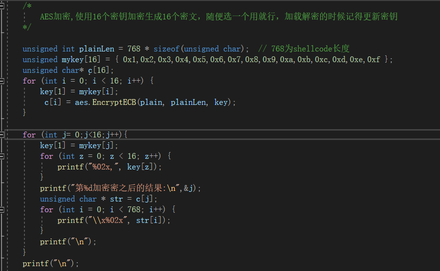
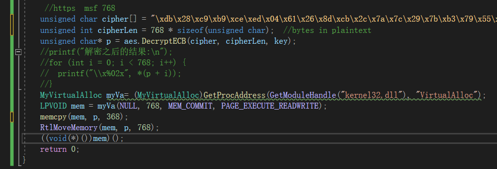
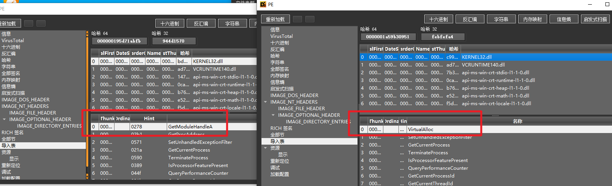

# AESLoader

## 一、介绍

shellcodeloder一个aes的解密加载器：

项目有两部分功能：

1、对给出的shellocde使用aes加密

2、对加密后的shellcode进行加载，加载的过程就是解密然后直接使用将shellcode地址强转成函数指针的形式作为函数执行：

加载执行的时候进行简单的winapi隐藏(动态加载实现实现导入表隐藏)

隐藏virtual 导出表 api调用

## 二、使用注意

测试的时候项目里面用的是msf的reverser_https的meterpreter shellcode；还有使用的时候加密解密的长度自己调整下，网上找的别人写的aes实现，

msf的https上线配置见msf https.txt文件